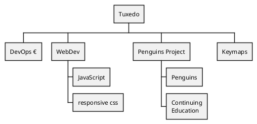
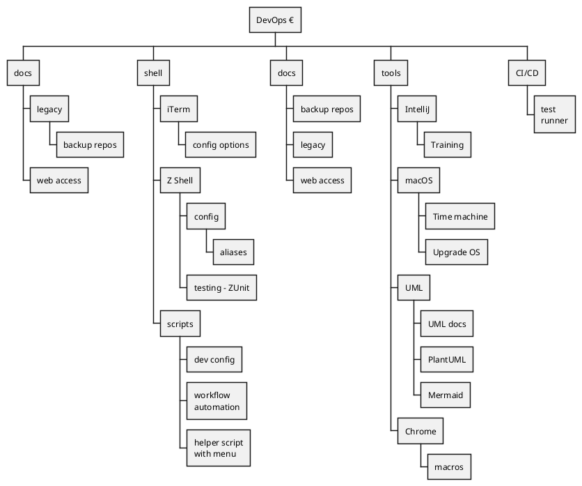

# Initiatives

## Tuxedo Initiatives

```puml
@startwbs
+ Tuxedo
 + DevOps €
 + WebDev
  + JavaScript
  + responsive css
 + Penguins Project
  + Penguins
  + Continuing\nEducation
 + Keymaps
@endwbs
```

## DevOps Initiatives

```puml
@startwbs
+ DevOps €
 + docs
  + legacy
   + backup repos
  + web access
 + shell
  + iTerm
   + config options
  + Z Shell
   + config
    + aliases
   + testing - ZUnit
  + scripts
   + dev config
   + workflow\nautomation
   + helper script\nwith menu
 + docs
  + backup repos
  + legacy
  + web access
 + tools
  + IntelliJ
   + Training
  + macOS
   + Time machine
   + Upgrade OS
  + UML
   + UML docs
   + PlantUML
   + Mermaid
  + Chrome
   + macros
 + CI/CD
  * test\nrunner
@endwbs
```
